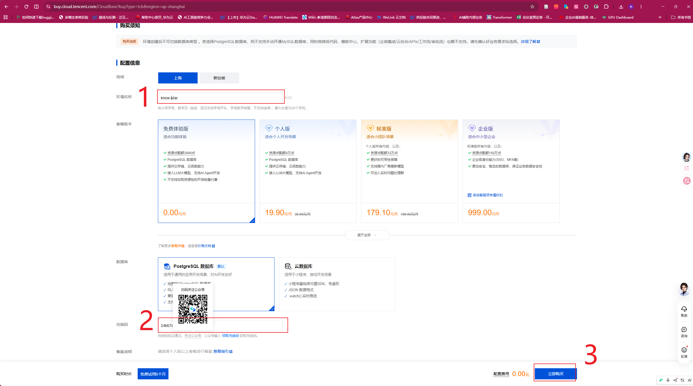
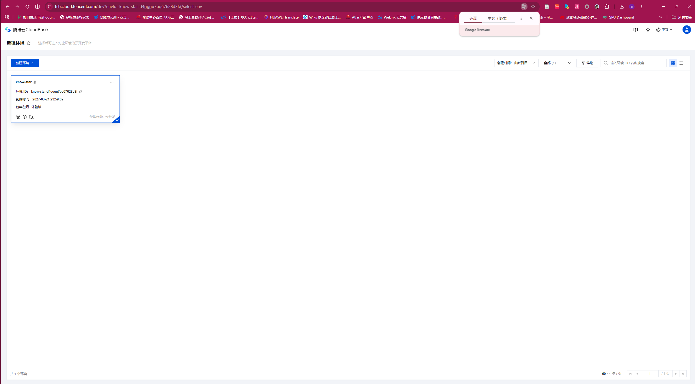

# 跟着截图开通自己的 CloudBase

环境配置阶段先按本页准备你自己的 CloudBase 环境；V2 再回来完成接入和真实数据验收。你需要腾讯云国内站账号。费用和可用地区以你当时看到的控制台为准；确认页面显示“免费体验版”和应付金额后再提交。教师截图只是帮助找入口，不代替你核对当前页面。

1. 打开[腾讯云控制台](https://cloud.tencent.com/)登录，再打开 [CloudBase 控制台](https://tcb.cloud.tencent.com/)。选择“新建环境”。
2. 选择**免费体验版**、**PostgreSQL 数据库**，填一个你认得的环境名。看清页面的应付金额、可用配额和到期说明。



3. 创建完成后，在环境列表复制完整 **EnvId**，并在自己的环境中找到浏览器用的 **Publishable Key**。这两项是 V2 的公开前端配置，可在 V2 填入自己工程的 `.env.local`；不要使用教师截图里的值，也不要把控制台管理密钥或密码发给 TraeWork。



4. 在 TraeWork 发：

```text
帮我把 CloudBase 接好，按下面做：
1. 打开 https://docs.cloudbase.net/skill.md，按说明完成接入。
2. 接入后只读核对我自己的 EnvId、地域和数据库类型确实是 PostgreSQL，告诉我结果及最相关的下一步。
```

只有 TraeWork 能实际读取你的环境信息，才算接入完成。学员电脑不必为 CloudBase 另装 npm 包；若 TraeWork 无法在当前模式接入，让它说明卡在 Skill、MCP 还是账号授权，不要假装已连接。

5. 让 TraeWork 检查本环境的 `usernamePassword` 登录方式是否启用，并引导你在 CloudBase 控制台的**身份认证／用户管理**中创建一个课程演示用户。用户名可用 `knowstar-demo`，密码由你在控制台设置为随机强密码并自行保管。无需创建第二个用户；网页和 APK 都手动登录这一个用户。控制台栏目名称如有变化，以当时页面和官方 Skill 为准。不要将密码发给 TraeWork、写入项目文件或打进 APK。

**预期结果**：控制台可见一个演示用户；TraeWork 只报告用户已创建和登录方式已启用，不回显密码。然后回到[V2 云端](05-V2-云端.md)完成真实网页登录和云端权限验收。
